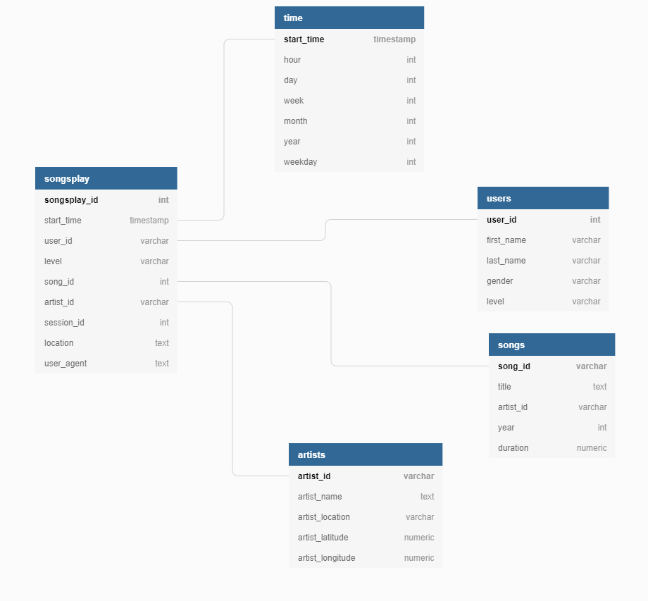

# Data Modeling with Postgres

## Project Summary
A startup called Sparkify (ficional name) wanted me to analyze data they've been collecting. Data Source is a music streaming app. The goal set by the analysts was to build a data platform that will help to understand which songs their users are listening to. Data is stored in two places: as JSON logs on user activity in a directory, as well as a directory with JSON metadata on the songs in their app.
The caveat was for me to design and create a Postgres database optimized for song play analysis. ETL pipeline had to be taken care of as well. 
Further below you will find database schema, file structure, and examples of the data analysis.
## Database
### Datasets
#### Song dateset
Contains details and metadata
*Sample Record*:
>```{
   "num_songs":1,
   "artist_id":"ARD7TVE1187B99BFB1",
   "artist_latitude":null,
   "artist_longitude":null,
   "artist_location":"California - LA",
   "artist_name":"Casual",
   "song_id":"SOMZWCG12A8C13C480",
   "title":"I Didn't Mean To",
   "duration":218.93179,
   "year":0
   }```
   
#### Log dataset - 
Contains user activity information
*Sample Record*:
>```{
>   "artist":null,
>   "auth":"Logged In",
   "firstName":"Kynnedi",
   "gender":"F",
   "itemInSession":0,
   "lastName":"Sanchez",
   "length":null,
   "level":"free",
   "location":"Cedar Rapids, IA",
   "method":"GET",
   "page":"Home",
   "registration":1541079034796.0,
   "sessionId":88,
   "song":null,
   "status":200,
   "ts":1541149530796,
   "userAgent":"\"Mozilla\/5.0 (Macintosh; Intel Mac OS X 10_8_5) AppleWebKit\/537.36 (KHTML, like Gecko) Chrome\/36.0.1985.125 Safari\/537.36\"",
   "userId":"89"
   }```
### Database Schema
To model the datasets "Star Schema" is used: the data if thereafter organized in facts and dimensions tables.
The schema can be seen in the picture below: 

## Project File Structure
This project is based on a set of the following files:
* ```create_tables.py``` - contains a set of postgresql queries for creating a database and tables
* ```etl.py``` - main ETL process as follows: find files, extract JSON data, transform and organize it according to Database Schema and load it to postgres
* ```sql_queries.py``` - contains all the necessary postgres query statement needed throughout the ETL process
## How to
Run the ```create_tables.py``` in order to create the sparkify database by
>```python create_tables.py```

Afterwards the ETL process can be done by
>```python etl.py```
## References
[PostgreSQL Documentation](https://www.postgresql.org/docs/)
[Pandas Documentation](https://pandas.pydata.org/pandas-docs/stable/)
[Psycopg Documentation](https://www.psycopg.org/docs/)
